# Platform Tree

This is the top-level branch map for Ziyawa.

```mermaid
flowchart TD
    A[ZIYAWA Platform] --> B[Public Experience]
    A --> C[Identity and Access]
    A --> D[Role Dashboards]
    A --> E[Marketplace and Discovery]
    A --> F[Transactions and Escrow]
    A --> G[Trust and Operations]
    A --> H[Admin Control Plane]
    A --> I[Infrastructure]

    B --> B1[Home]
    B --> B2[Ziwaphi Search]
    B --> B3[Events]
    B --> B4[Artists]
    B --> B5[Crew]
    B --> B6[Organizers]
    B --> B7[Static Pages]
    B --> B8[Support]

    C --> C1[Signup]
    C --> C2[Signin]
    C --> C3[Reset Password]
    C --> C4[MFA Setup]
    C --> C5[MFA Challenge]
    C --> C6[Admin OTP]

    D --> D1[Groovist Dashboard]
    D --> D2[Organizer Dashboard]
    D --> D3[Artist Dashboard]
    D --> D4[Provider Dashboard]
    D --> D5[Settings]
    D --> D6[Notifications]
    D --> D7[Messages]
    D --> D8[Wallet]

    E --> E1[Event Creation and Management]
    E --> E2[Ticketing]
    E --> E3[Artist Booking]
    E --> E4[Crew Booking]
    E --> E5[Event Team and Check-in]

    F --> F1[Ticket Payments]
    F --> F2[Booking Payments]
    F --> F3[Wallet Deposits]
    F --> F4[Withdrawals]
    F --> F5[Escrow Release]
    F --> F6[Paystack Webhooks]

    G --> G1[Reviews]
    G --> G2[Reports]
    G --> G3[Notifications]
    G --> G4[Messaging Gate]
    G --> G5[Verification]
    G --> G6[Disputes]

    H --> H1[Users]
    H --> H2[Events]
    H --> H3[Finance]
    H --> H4[Reports]
    H --> H5[Reviews]
    H --> H6[Communications]
    H --> H7[Support]
    H --> H8[Verifications]
    H --> H9[Audit Logs]
    H --> H10[Analytics]
    H --> H11[Settings]

    I --> I1[Next.js App Router]
    I --> I2[Supabase Auth DB Storage]
    I --> I3[Vercel Deployment]
    I --> I4[Cron Jobs]
    I --> I5[Migrations]
```



## Product Branch Tree

```text
ZIYAWA
├── Public Experience
│   ├── Home
│   ├── Ziwaphi event search
│   ├── Event details and ticket purchase entry
│   ├── Artist discovery and public profiles
│   ├── Crew discovery and public profiles
│   ├── Organizer discovery and public profiles
│   ├── Static pages: About, FAQ, Terms, Privacy, Refunds
│   └── Support entry
├── Identity and Access
│   ├── Sign up
│   ├── Sign in
│   ├── Password reset
│   ├── Auth callback and errors
│   ├── Admin OTP
│   ├── MFA setup
│   └── MFA challenge
├── Core User Surfaces
│   ├── Profile
│   ├── Messages
│   ├── Wallet
│   ├── Notifications
│   ├── Settings
│   ├── Tickets
│   └── Event work
├── Organizer Branch
│   ├── Organizer dashboard
│   ├── Event list and event creation
│   ├── Event manage, edit, media, team, check-in
│   ├── Event bookings
│   ├── Artist gate: /dashboard/organizer/book-artist/[id]
│   ├── Legacy artist redirect: /dashboard/organizer/book
│   ├── Crew gate: /dashboard/organizer/book-crew/[id]
│   ├── Crew bookings dashboard
│   └── Organizer reviews dashboard
├── Artist Branch
│   ├── Artist dashboard
│   ├── Setup
│   ├── Media
│   ├── Discography
│   └── Social links
├── Provider Branch
│   ├── Provider dashboard
│   ├── Setup
│   ├── Services
│   ├── Portfolio
│   ├── Media
│   └── Social links
├── Trust and Coordination
│   ├── Reviews
│   ├── Reports
│   ├── Verification
│   ├── Notifications
│   └── Booking-gated messaging
├── Payments and Escrow
│   ├── Ticket payment init and callback
│   ├── Booking payment init
│   ├── Deposit and withdrawal
│   ├── Bank verification
│   ├── Webhook confirmation
│   └── Escrow release
└── Admin Control Plane
    ├── Admin dashboard
    ├── Analytics
    ├── Audit logs
    ├── Users
    ├── Events
    ├── Finance
    ├── Reports
    ├── Reviews
    ├── Communications
    ├── Support
    ├── Verifications
    └── Settings
```

## Branch Ownership Map

Use this table to find the first place to inspect when something needs fixing.

| Branch | Start Here In UI | First Code Surface | Typical Server Surface |
|---|---|---|---|
| Homepage and discovery | `/`, `/ziwaphi` | `src/app/page.tsx`, `src/app/ziwaphi/page.tsx` | `src/app/api/ziwaphi/search/route.ts`, `src/app/api/events/search/route.ts` |
| Event detail and ticket buying | `/events/[id]` | `src/app/events/[id]/page.tsx`, `src/components/events/event-details.tsx` | `src/app/api/payments/ticket/route.ts`, `src/app/api/tickets/*` |
| Artist public booking entry | `/artists/[id]` | `src/app/artists/[id]/page.tsx`, `src/components/artists/*` | `src/app/dashboard/organizer/book-artist/[id]/page.tsx`, `src/app/api/bookings/artist-request/route.ts` |
| Crew public booking entry | `/crew/[id]` | `src/app/crew/[id]/page.tsx` | `src/app/dashboard/organizer/book-crew/[id]/page.tsx`, `src/app/api/provider-bookings/request/route.ts`, `src/app/api/events/[id]/team/route.ts` |
| Organizer event operations | `/dashboard/organizer/events/*` | `src/app/dashboard/organizer/events/**/page.tsx` | `src/app/api/events/[id]/*` |
| Artist booking lifecycle | Organizer event bookings, artist dashboard | `src/components/bookings/book-artist-form.tsx`, `src/components/bookings/booking-actions.tsx` | `src/app/api/bookings/artist-request/route.ts`, `src/app/api/bookings/[id]/respond/route.ts`, `src/app/api/bookings/[id]/accept-counter/route.ts`, `src/app/api/payments/booking/route.ts` |
| Crew booking lifecycle | Crew gate and organizer crew pages | `src/app/dashboard/organizer/book-crew/[id]/page.tsx` | `src/app/api/provider-bookings/request/route.ts`, `src/app/api/provider-bookings/route.ts`, `src/app/api/payments/booking/route.ts` |
| Messaging | `/messages` | `src/app/messages/page.tsx`, `src/app/messages/messages-client.tsx` | `src/app/api/conversations/start/route.ts` |
| Reports | Report dialogs and admin reports | `src/components/report-dialog.tsx` | `src/app/api/reports/route.ts` |
| Notifications | `/dashboard/notifications` | `src/app/dashboard/notifications/page.tsx` | `src/app/api/notifications/route.ts`, `src/app/api/notifications/preferences/route.ts` |
| Wallet and payouts | `/wallet` | `src/app/wallet/page.tsx` | `src/app/api/payments/deposit/route.ts`, `src/app/api/payments/withdraw/route.ts`, `src/app/api/payments/verify-account/route.ts`, `src/app/api/payments/release/route.ts` |
| Admin operations | `/admin/*` | `src/app/admin/**/page.tsx` | `src/app/api/admin/**/route.ts` |
