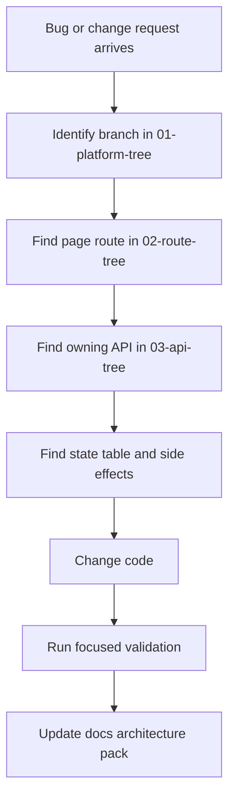

# Branch Maintenance

This file explains how to keep the tree useful and how to use it during fixes, upgrades, and regressions.

## Core Rule

Every platform branch has three layers:

1. Entry surface
   Public page, dashboard page, or trigger button.
2. Control surface
   Gate page, form component, or route handler that owns decisions.
3. State surface
   Database table, booking state, payment state, or notification side effect.

If something breaks, trace all three layers.

## Debug Flow

## Branch Checklists

### Ticketing Branch

Entry surfaces:

- `/events/[id]`
- `/payments/callback`
- `/dashboard/tickets`

Control surfaces:

- `src/components/events/event-details.tsx`
- `src/components/payments/payment-dialog.tsx`
- `src/app/api/payments/ticket/route.ts`
- `src/app/api/webhooks/paystack/route.ts`

State surfaces:

- `events`
- `event_ticket_types`
- `tickets`
- `transactions`

Smoke checks:

1. Event page loads and shows correct ticket tier data.
2. Quantity clamps correctly.
3. Checkout initializes with correct totals.
4. Callback page resolves a successful payment.
5. Tickets appear in dashboard.

### Artist Booking Branch

Entry surfaces:

- `/artists/[id]`
- `/dashboard/organizer/book-artist/[id]`
- `/dashboard/organizer/events/[id]/book`
- `/dashboard/organizer/events/[id]/bookings`
- `/dashboard/artist`

Control surfaces:

- `src/components/artists/artist-profile.tsx`
- `src/components/artists/artist-profile-enhanced.tsx`
- `src/app/dashboard/organizer/book-artist/[id]/page.tsx`
- `src/components/bookings/book-artist-form.tsx`
- `src/components/bookings/booking-actions.tsx`
- `src/app/api/bookings/artist-request/route.ts`
- `src/app/api/bookings/[id]/respond/route.ts`
- `src/app/api/bookings/[id]/accept-counter/route.ts`
- `src/app/api/payments/booking/route.ts`

State surfaces:

- `bookings`
- `conversations`
- `notifications`
- `transactions`

Smoke checks:

1. Public artist page shows the correct CTA.
2. Gate page blocks non-organizers and organizers without published events.
3. Booking request creates a pending booking.
4. Messaging opens only after booking relationship is valid.
5. Artist can accept, decline, or counter.
6. Organizer can accept counter and pay.

### Crew Booking Branch

Entry surfaces:

- `/crew/[id]`
- `/dashboard/organizer/book-crew/[id]`
- `/dashboard/organizer/crew`

Control surfaces:

- `src/app/crew/[id]/page.tsx`
- `src/app/dashboard/organizer/book-crew/[id]/page.tsx`
- `src/app/api/provider-bookings/request/route.ts`
- `src/app/api/provider-bookings/route.ts`
- `src/app/api/events/[id]/team/route.ts`
- `src/app/api/payments/booking/route.ts`

State surfaces:

- `providers`
- `provider_services`
- `provider_bookings`
- `event_team_members`
- `conversations`
- `transactions`

Smoke checks:

1. Public crew page shows correct work vs service actions.
2. Gate page respects organizer state, published upcoming events, and provider availability.
3. Service request creates pending provider booking.
4. Event work invite rejects unpublished or past events.
5. Messaging only unlocks after valid booking relationship.

### Reports Branch

Entry surfaces:

- report buttons and dialogs throughout the app
- `/admin/reports`
- `/admin/reports/[id]`

Control surfaces:

- `src/components/report-dialog.tsx`
- `src/app/api/reports/route.ts`

State surfaces:

- `reports`
- `notifications`
- email side effects

Smoke checks:

1. Report submits without hanging.
2. Allowed reasons match UI and DB constraint.
3. Admin gets notification.
4. Reporter gets confirmation.

## Update Protocol

After any platform change:

1. Update route tree if page paths changed.
2. Update API tree if server routes changed.
3. Update branch checklists if flow rules changed.
4. Update [MASTER.md](../../MASTER.md) only if business model, role definitions, or major workflows changed.

## Suggested Working Rhythm

For every major feature or fix, keep this checklist in the PR or working notes:

- branch touched
- routes touched
- APIs touched
- DB tables or migrations touched
- side effects touched: email, notification, conversation, webhook, cron
- smoke checks run
- docs updated
